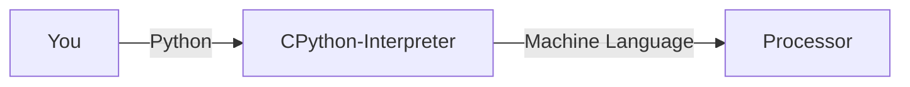

# Python Course for Beginners
> Video Version: insert yt link

## Sections 1: What is Code?

### What is Code?
**Code is essentially the set of instructions given to a computer.** A computer is just a machine that can take in data and information, and give an output. without code or programming, a computer cannot do anything.

The raw computer code is a collection of long strings of letters and numbers, called ***machine language***, that is meaningless to us humans, but perfect for computers. That is why programmers use ***programming languages***, which are much easier to understand and make sense of for people. When a program is run, the code written by the human is translated into machine language so the computer can understand it. Languages such as Python and JavaScript are languages that this interpreter or translator can understand so it can do its job, taking something a person has made, and making it into something the computer can understand.

Example (This will be explained more in depth later):

### What is Python?

## Section 2: Setting Up

## Section 3: The Basics
  
  
